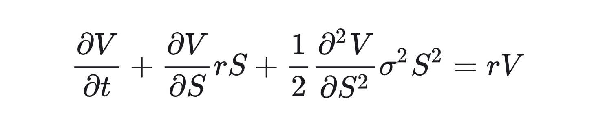
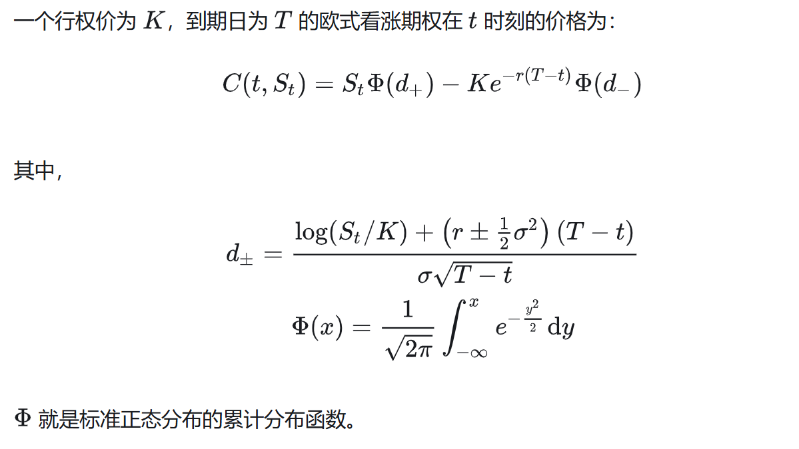

# ‌<font color=MediumBlue>Black-Scholes方程：用微分方程破解金融时间密码</font>	

1973年，芝加哥期权交易所开市当天，一篇名为《期权与公司负债定价》的论文悄然发表。这篇由Fischer Black、Myron Scholes和Robert Merton完成的论文，用一道偏微分方程掀起了金融革命——Black-Scholes方程不仅让期权定价从“赌徒直觉”升级为“科学计算”，更催生了现代量化金融的诞生。

##  核心问题‌：如何给一份“未来以固定价格买卖股票的权利”定价？  

假设你持有某股票的看涨期权（到期日T，执行价K），需要计算此刻期权的合理价格。  
Black-Scholes模型的突破在于，它将这个问题转化为‌**求解偏微分方程‌的数学问题**。

### Black-Scholes微分方程



- **r**是无风险利率（一般用国债利率等近似表示）
- **V**是t时刻欧式看涨期权的价格  
- **S**是标的资产在t时刻价格
- **sigma**是波动率

#### 模型假设：
- 它适用于只能在到期时行使的欧式期权  
- 在期权有效期内不支付股息    
- 无套利机会：市场不存在套利机会，所有资产的价格反映了其真实价值。
- 购买期权没有交易和佣金成本，允许卖空, 且收益可以全部投资    
- 无风险利率已知并且在期内保持不变.
- 标的资产价格服从几何布朗运动：股票或标的资产的价格随时间变化，且其变化是一个随机过程，具体遵循几何布朗运动。

#### 方程的建立： 
具体需要知识基础如：
- 期权概念（买权与卖权，标的价格，行权价格)  
- 市场概念（多头与空头,看涨看跌，套利，期望)  
- 金融知识（期权平价公式,贴现值，风险中性假设，无套利原理）  
- 数学知识（伊藤引理，几何布朗运动）   

具体可以看<https://zhuanlan.zhihu.com/p/26140996>或者有关讲解视频，篇幅原因不多展开

## <font color=Crimson>先用已知Black-Scholes公式求解欧式期权价格（Black—Scholes微分方程的解析解）</font>



#### 输入变量：
- 正股——到期市场价格价格（每股）：S；
- 期权的执行价格（每股）：K；
- 到期时间 T；
- 持续复利 r； 
- 波动性:sigma;

就是公式的套用，后面有使用PDE数值解的方式求解

```
code
```

## <font color=Crimson>Black-Scholes PDE 数值积分解法原理</font>


这段代码实现了基于 Black-Scholes 偏微分方程的期权定价数值解法，核心原理如下：

#### 1. 变量变换与参数计算
- **对数变换**：将资产价格比转换为对数形式 `x = ln(S/K)`，简化方程形式
- **时间缩放**：引入 `tau = sigma²T`，将时间变量归一化
- **计算 d1/d2**：利用 Black-Scholes 公式中的核心参数
  ```
  d1 = (x + (r + 0.5σ²)T) / (σ√T)
  d2 = d1 - σ√T
  ```

#### 2. 边界条件实现
- **到期收益函数**：直接实现 `max(S-K,0)` 或 `max(K-S,0)`
- **积分范围优化**：选择 `[-5,5]` 作为积分区间，覆盖 99.99994% 的概率质量
- **数值稳定性**：通### 边界条件在Black - Scholes PDE解法中的重要性
在Black - Scholes偏微分方程（PDE）求解期权价格的过程中，***边界条件起着关键作用***。它们定义了期权在不同资产价格和时间节点下的价值，是准确求解期权价格的基础
得出符合实际情况的期权价格。 s=1e-10`）确保计算准确性
#### 3. 积分求解过程
1. **概率密度建模**：利用几何布朗运动特性，将资产价格对数表示为正态分布
   ```
   y = x + (r - 0.5σ²)T + σ√T·z
   ```
   其中 `z` 服从标准正态分布

2. **收益期望计算**：
   - 对每个 `z` 值，计算对应的资产价格 `S' = K·e^y`
   - 应用边界条件得到期权收益 `payoff`
   - 乘以标准正态分布概率密度 `pdf(z)`
   - 对所有可能的 `z` 积分，得到期望收益

3. **风险中性折现**：将期望收益按无风险利率折现
   ```
   option_price = e^(-rT) × expected_payoff
   ```
#### 4. 算法特点
- **优势**：
  - 直接从 PDE 出发，无需显式求解方程
  - 同时适用于看涨/看跌期权
  - 高精度数值积分保证结果准确性
  - 自动处理复杂边界条件

- **局限性**：
  - 计算效率低于解析公式（如 Black-Scholes 公式）
  - 对奇异期权需调整边界条件函数

#### 5. 与理论边界条件的对应
- **到期收益条件**：通过 `boundary_condition` 函数精确实现
- **无穷大资产价格**：积分区间足够宽时自动满足
- **零资产价格**：通过折现因子 `e^(-rT)` 隐式处理看跌期权的下限

<font color=MediumBlue>这种数值积分方法本质上是蒙特卡洛模拟的一种确定性变体，通过对正态分布的精确积分替代随机采样，在保证准确性的同时提高了计算效率。</font>

 ```
code
 ```

#### Output Variables: 输出变量：¶
- 正态分布的累积密度函数 N（.）
  - N（d2） 是期权被行使的风险调整后概率。
  - N（d1） 是在期权到期时收到股票的概率。
- The Greek letters  希腊字母
  - Delta：期权价格相对于标的资产价格变化率的变化率。
  - Gamma：delta 的变化率相对于标的资产价格的变化率。
  - Vega：期权价格相对于标的资产波动率的变化率。
  - Rho：期权价格相对于利率的汇率。
  - Theta：期权价格随时间的变化率。

<font color=DarkRed>***Black-Scholes方程的价值远超数学范畴——它将金融市场的不确定性封装进sigma，把时间价值折叠进 `e^(-rT)`，让风险在偏导数的舞步中显形。尽管现实比模型复杂千万倍，但那些在彭博终端上跳动的期权价格，仍在向50年前的那道微分方程默默致敬。正如Scholes所说：“我们不是找到了真理，而是发明了一种语言。” 这种语言，至今仍在重新定义金钱与时间的游戏规则。*** </font>

### 参考资料：  
[数值解]<https://zhuanlan.zhihu.com/p/332684940>  
[解析解]<https://zhuanlan.zhihu.com/p/142121483>
